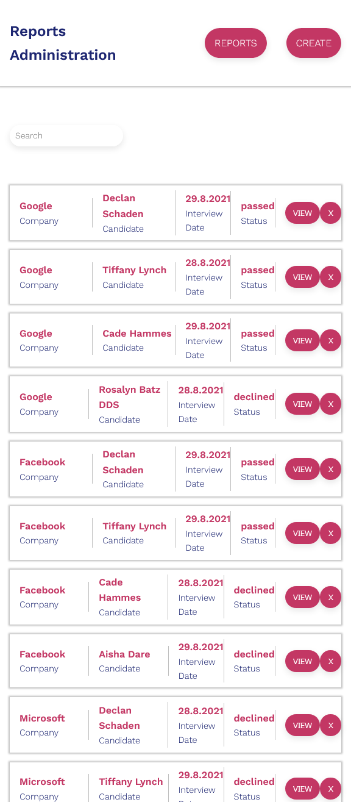
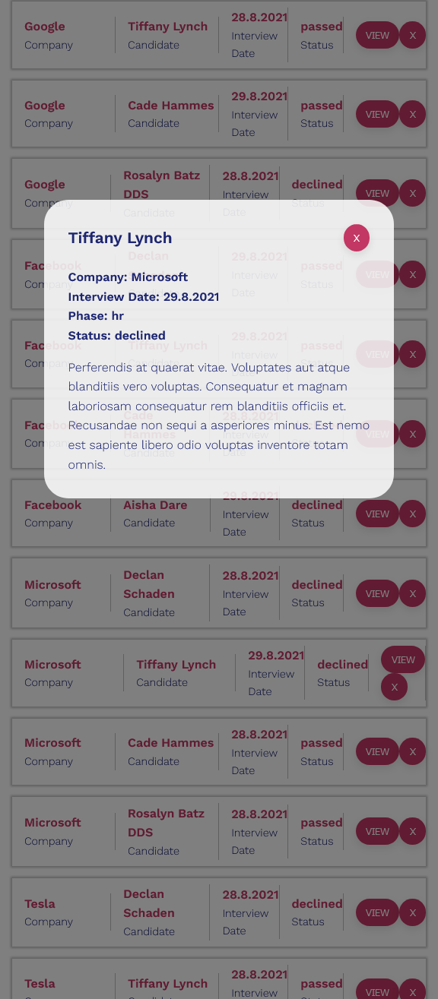
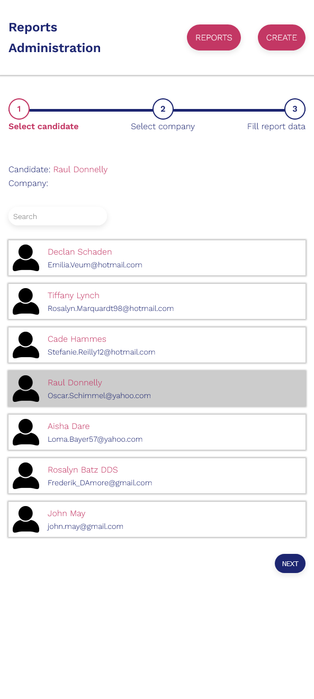
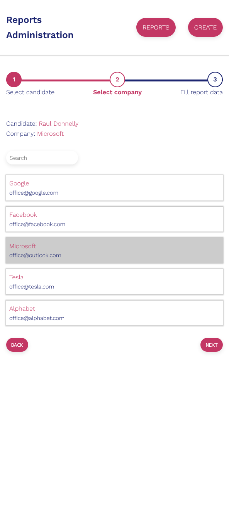
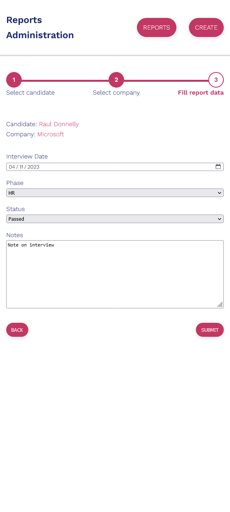

# Interview Reports - Part II

BIT Frontend Bootcamp Final Project - Web app system for tracking job interviews.

## Reports API

Regarding interviews reports API you will be using a local web server. Complete API which is needed for developing your tasks can be found at: [github repo](https://github.com/nenadbugaric/interviews-reports-api-mock/)

Set up instructions:

- git clone https://github.com/nenadbugaric/interviews-reports-api-mock/
- git checkout auth-client
- npm install
- npm start

On the github repository page you will find all information about how to start a web server and how to use API locally for development.

## Project

Project is divided into two sections.

- This is second part - admin panel which is used for reports management (creation, updating ...).

Administrative Panel application should consist of:

1. Report List
   o Reports should be rendered in a list
   o Each Report can be viewed in more detail or deleted
   o For viewing report in more details Modal (dialog) is used
   o List of reports can be filtered by candidate or company name!
2. Submit Report Page
   o Submitting a Report should be done through a “Wizard”
   o Wizard is constructed from three steps:
   ▪ Step 1: Select Candidate
   ● Candidates will appear in a list
   ● List of Candidates can be filtered by Candidate Name
   ● When user click on candidate it’s selected
   ● After Candidate is selected “Next” button become enabled and
   user can click on it
   ● When user click on “Next” button next section “Select Company”
   should be presented

▪ Step 2: Select a Company
● Companies will appear in a list
● List of Companies can be filtered by Company Name
● After Company is selected “Next” button become enabled and
user can click on it
● When user click on “Next” button next section “Fill Report
Details” should be presented

▪ Step 3: Fill Report Details
● User should be able to enter all Report fields
o Date/Time
o Phase: cv, hr, tech, final
o Status: passed, declined
o Notes
● All inputs should be validated
o All input fields are required
o Phase must be one of: cv, hr, tech, final
o Status must be one of: passed, declined 
o Date can not be in the future
o Date input should be provided via date-picker component
● When the user clicks “Submit” , a request with all data for
creating a report is sent.

● After successfully created report user is redirected to the landing
page

## Tools

- ReactJS
- Semantic HTML5 markup
- SCSS
- BEM

## Screenshots

